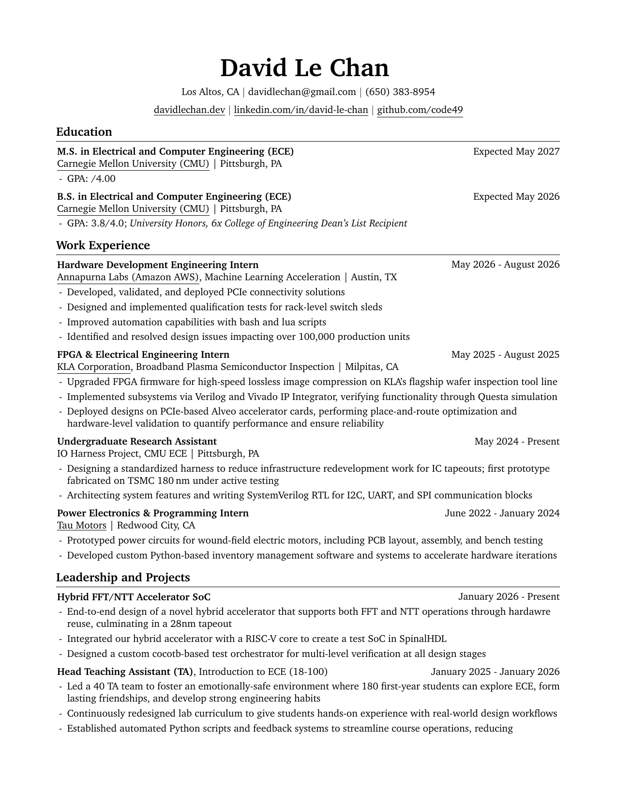

# Resume

This repository contains the LaTeX source code and configuration for building David Chan's resume. It uses a reproducible [Nix shell environment](shell.nix) to manage dependencies (like `texlive` and `poppler-utils`), and is configured for VS Code with the LaTeX Workshop extension to automatically compile the LaTeX source and regenerate a preview image on file save.

---
### Preview

_A PDF copy can be found at [this link](DavidChan_Resume.pdf) :)_ 

 