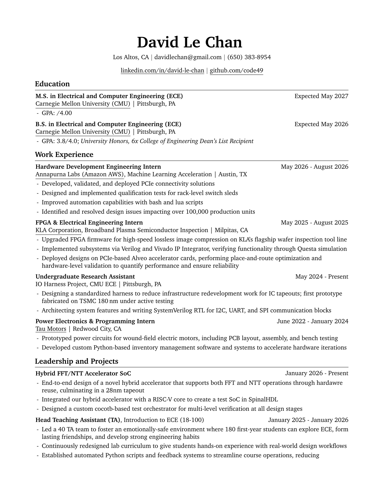
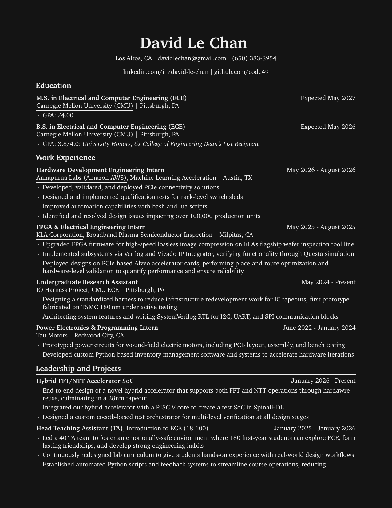

# Resume

This repository contains the LaTeX source code and configuration for building David Chan's resume. It uses a reproducible [Nix shell environment](shell.nix) to manage dependencies (like `texlive` and `poppler-utils`), and is configured for VS Code with the LaTeX Workshop extension to automatically compile the LaTeX source and regenerate preview images on file save.

---

### Build Instructions

You can enter the Nix shell with `nix-shell` and run the following compilation scripts:

* **Light Mode (Default)**:
  ```bash
  nix-shell shell.nix --run "latexmk -synctex=1 -interaction=nonstopmode -file-line-error -pdf -outdir=build main.tex && cp build/main.pdf DavidChan_Resume.pdf && pdftoppm -png -r 150 -singlefile DavidChan_Resume.pdf build/preview"
  ```
* **Dark Mode**:
  ```bash
  nix-shell shell.nix --run "pdflatex -synctex=1 -interaction=nonstopmode -file-line-error -output-directory=build -jobname=main_Dark '\def\darkmodeenabled{1}\newif\ifdarkmode\darkmodetrue\input{main.tex}' && cp build/main_Dark.pdf DavidChan_Resume_Dark.pdf && pdftoppm -png -r 150 -singlefile DavidChan_Resume_Dark.pdf build/preview_dark"
  ```

---

### Previews

* **Light Mode**: [Download PDF](DavidChan_Resume.pdf)
  

* **Dark Mode**: [Download Dark PDF](DavidChan_Resume_Dark.pdf)
  

---

### Compiling Without Nix

If you are not using Nix/NixOS, you can compile the resume using your local TeX Live distribution and system utilities (ensure `latexmk`, `pdflatex`, and `pdftoppm` are installed on your path):

* **Light Mode (Default)**:
  ```bash
  latexmk -synctex=1 -interaction=nonstopmode -file-line-error -pdf -outdir=build main.tex && cp build/main.pdf DavidChan_Resume.pdf && pdftoppm -png -r 150 -singlefile DavidChan_Resume.pdf build/preview
  ```
* **Dark Mode 🌙**:
  ```bash
  pdflatex -synctex=1 -interaction=nonstopmode -file-line-error -output-directory=build -jobname=main_Dark '\def\darkmodeenabled{1}\newif\ifdarkmode\darkmodetrue\input{main.tex}' && cp build/main_Dark.pdf DavidChan_Resume_Dark.pdf && pdftoppm -png -r 150 -singlefile DavidChan_Resume_Dark.pdf build/preview_dark
  ```